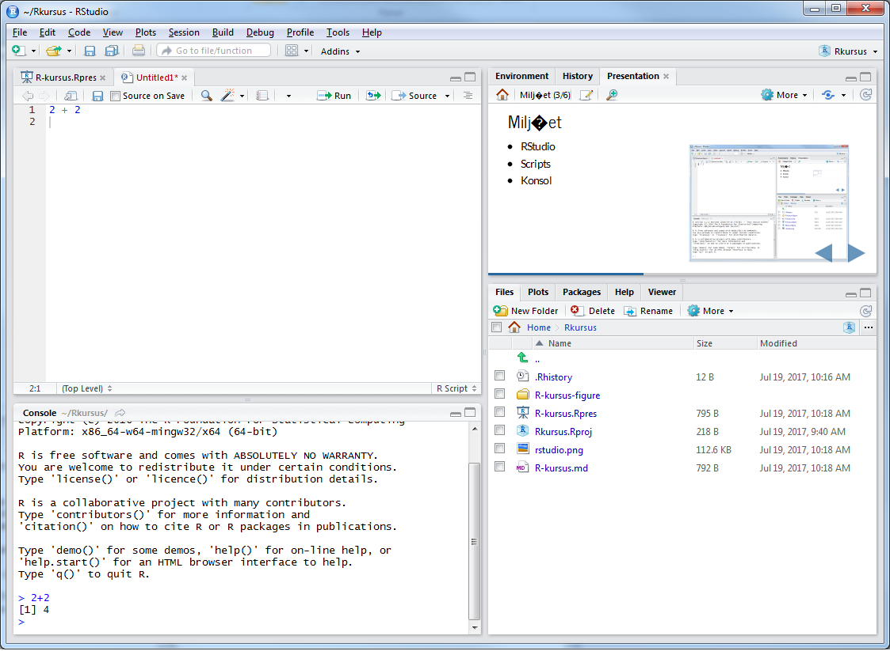
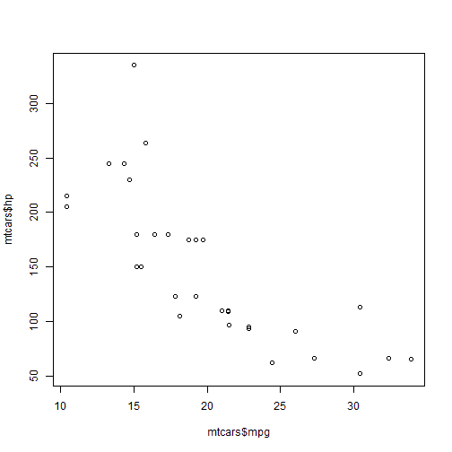
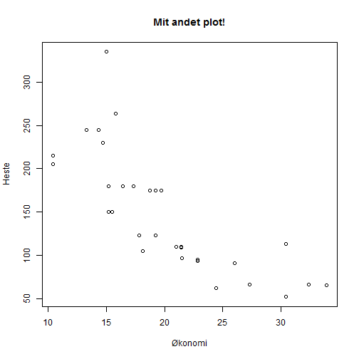
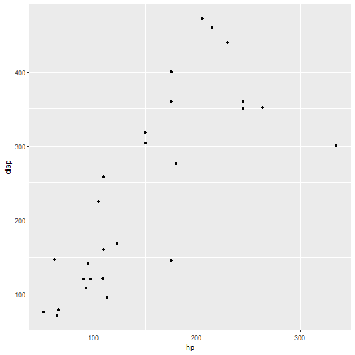

R-kursus - introduktion
========================================================
author: Christian Knudsen
date: 
autosize: true

En introduktion til R
========================================================

For begyndere

- Hvem er vi?
- Hvad er R?
- Miljøet
- Variable
- Datatyper
- Operatorer
- Funktioner
- Løkker og strukturer
- Biblioteker
- Scripts
- Visualisering


Hvem er vi?
==============================
Datalab!

- [Humlab]
- DSSL (Digital Social Science Lab)
- Datalab (det ligger på Nord)

Software, hardware og praktisk hjælp til indsamling, analyse og visualisering af data.

Kontakt os på datalab-nord@kb.dk.

Hvad er R?
==================
Open source programmeringssprog, designet til statistiske beregninger og datavisualiseringer.

Kommandoliniebaseret - med mulighed for grafiske brugerflader

Graflommeregner på steroider.

***

Øvelser?

- Åben Rstudio
- Tast med på eksemplerne
- Spørg!


Miljøet
================
- RStudio
- Scripts
- Konsol

***



<!--
R er et sprog hvor vi giver det en kommando, og får et svar. I kan se det i konsollen. Jeg har skrevet 2 + 2, og trykket enter.
Svaret er: 4
Man kan gemme scripts, så man ikke skal taste det hele ind hver gang. 
-->

Meget avanceret lommeregner
===================================


```r
1 + 1 
```

```
[1] 2
```


Variable
===================================

R er baseret på et gammelt sprog. Så vi bruger <- i stedet for =.

Man kan bruge =. Lad være med det.


```r
a <- 2
b <- 2
a + b
```

```
[1] 4
```


Datatyper
========================================================
Hvilke typer af variable kan vi så have?

- Logical
- Numeric
- Integer
- Complex
- Character
- Raw

***


- TRUE/FALSE
- Tal: 3,141
- Heltal: -1, 0, 1, 2
- Komplekse tal: 3 + 2i
- Tekst: "Hej verden!"
- Raw: Rå bytes
- NA: Ingenting er vigtigt!


Objekter
========================================================
Vi arbejder med data => Så vi har ikke kun et tal => behov for at samle disse tal.
- Vectors
- Lists
- Matrices
- Arrays
- Factors
- Data Frames


Vektorer
================
Samling af elementer af samme type


```r
æble <- c('rød', 'grøn', 'gul')
print(æble)
```

```
[1] "rød"  "grøn" "gul" 
```

```r
æble[1]
```

```
[1] "rød"
```

c() er en funktion, der kombinerer værdier til en vektor, eller en liste (den vender vi tilbage til)

Vektorer 2
=========================
Mange funktioner er vektoriserede.


```r
a <- c(1,2,3,4)
a
```

```
[1] 1 2 3 4
```

```r
b <- a + 1
b
```

```
[1] 2 3 4 5
```

```r
(c <- a + a[2])
```

```
[1] 3 4 5 6
```
Når udtrykket sættes i parantes - så bliver det ikke kun evalueret, resultatet bliver også skrevet ud!

Lister
=================
Et objekt der kan indeholde elementer af forskellig type

```r
(liste <- list(c(1,2,3), 42.47, "Hej"))
```

```
[[1]]
[1] 1 2 3

[[2]]
[1] 42.47

[[3]]
[1] "Hej"
```

```r
liste[2]
```

```
[[1]]
[1] 42.47
```

Det har så den konsekvens, at det her giver en fejl:

liste + 2


Matrices
=================
Et to-dimensionelt, rektangulært datasæt.

```r
linie1 <- c(1, 2, 3, 4, 5, "d")
matrice <- matrix(linie1, nrow=2, ncol=3,  byrow=TRUE)
matrice
```

```
     [,1] [,2] [,3]
[1,] "1"  "2"  "3" 
[2,] "4"  "5"  "d" 
```

```r
matrice[1,]
```

```
[1] "1" "2" "3"
```

***


```r
matrice[,1]
```

```
[1] "1" "4"
```

```r
matrice[2,1]
```

```
[1] "4"
```

Bemærk notationen [1,] og [,1].

Først række, så kolonne.

Arrays
====================
Matricer i flere end 2 dimensioner

```r
(a <- array(c('a','b'),dim = c(3,3,2)))
```

```
, , 1

     [,1] [,2] [,3]
[1,] "a"  "b"  "a" 
[2,] "b"  "a"  "b" 
[3,] "a"  "b"  "a" 

, , 2

     [,1] [,2] [,3]
[1,] "b"  "a"  "b" 
[2,] "a"  "b"  "a" 
[3,] "b"  "a"  "b" 
```

***


```r
a[1,2,2]
```

```
[1] "a"
```


```r
a[2,2,2]
```

```
[1] "b"
```


Factors
=======================
- Kategoriske variable
- Variable der kan have et begrænset antal værdier
- Ofte kvalitative
- Eksempel: Hvad er dit foretrukne fysiske bibliotek?
- Svarmuligheder: KUB-Nord, KUB-Frederiksberg, KUB-Samf (kun det første svar er rigtigt)
- Mange statistiske metoder "ved" hvordan kategoriske variable skal behandles. Men kun hvis de "ved" at det er kategoriske variable.

***


```r
svar <- c('Nord', 'Nord', 'Samf', 'Frb', 'Nord')
svar_faktor <- factor(svar)
print(svar_faktor)
```

```
[1] Nord Nord Samf Frb  Nord
Levels: Frb Nord Samf
```

```r
table(svar_faktor)
```

```
svar_faktor
 Frb Nord Samf 
   1    3    1 
```

<!---
Det er også en effektiv måde at gemme data. Der bliver gemt en vektor med "levels", og en anden med numeriske værdier
for de levels. Det fylder mindre.
-->


Data Frames
====================
En liste af vektorer af samme længde

MEGET brugt


```r
navn <- c('Mazda', 'Datsun', 'Mercedes')
heste <- c(110, 93, 95)
gear <- c(4, 4, 4)
biler <- data.frame(navn, heste, gear)

print(biler)
```

```
      navn heste gear
1    Mazda   110    4
2   Datsun    93    4
3 Mercedes    95    4
```

***


```r
biler$heste
```

```
[1] 110  93  95
```

```r
biler$navn[1]
```

```
[1] Mazda
Levels: Datsun Mazda Mercedes
```

```r
biler[2]
```

```
  heste
1   110
2    93
3    95
```


Operatorer
=======================
- De fire regnearter: +,-,/,*
- Relationer: <, >, ==, <=, >=, !=
- Logiske: &, |, !
- Assignment: <-, <<-, =, ->
- Diverse: :, %in%

***

- De virker alle på vektorer:

```r
a <- c(1,2,3,4)
a+2
```

```
[1] 3 4 5 6
```

```r
a/2
```

```
[1] 0.5 1.0 1.5 2.0
```

```r
a*2
```

```
[1] 2 4 6 8
```

```r
a==2
```

```
[1] FALSE  TRUE FALSE FALSE
```

Flere operatorer
=====================


```r
1 < 2
```

```
[1] TRUE
```

```r
1 > 2
```

```
[1] FALSE
```

```r
1 %in% c(1,2,3,4)
```

```
[1] TRUE
```

```r
5 %in% c(1,2,3,4)
```

```
[1] FALSE
```


Funktioner
=====================
- Dem har vi brugt en del af allerede
- Hvis det virker uoverskueligt - betragt dem som en sort kasse. Noget hældes ind, noget andet kommer ud.

- Altid på formen: funktionsnavn(input) - og giver noget output.

- I tvivl?:  ?funktionsnavn
- Panisk?:  ??funktionsnavn

*** 


```r
max(biler$heste)
```

```
[1] 110
```

```r
mean(biler$heste)
```

```
[1] 99.33333
```


Din egen funktion
===============================

Man kan lave sine egne:

```r
minfunktion <- function(a){
  resultat <- a*6
  return(resultat)
}
```

***


```r
minfunktion(7)
```

```
[1] 42
```

```r
minfunktion(7)+5
```

```
[1] 47
```


Løkker og strukturer
==========================
- Ofte har vi behov for at gøre det samme igen og igen
- Men måske på forskelligt data.
- Løkker!

"for" løkken.
for hvert element "i" i en eller anden sekvens gør følgende


```r
1:10
```

```
 [1]  1  2  3  4  5  6  7  8  9 10
```


***

```r
for(i in 1:10){
  print(i)
}
```

```
[1] 1
[1] 2
[1] 3
[1] 4
[1] 5
[1] 6
[1] 7
[1] 8
[1] 9
[1] 10
```


While-løkken
=======================
så længe en eller anden betingelse er opfyldt, gør følgende

Den nysgerrige studerende kan selv skrive ?break og ?next i konsollen. De er nyttige, men vi skal videre!

***


```r
i <- 0
while(i < 10){
  print(i)
  i <- i + 1
}
```

```
[1] 0
[1] 1
[1] 2
[1] 3
[1] 4
[1] 5
[1] 6
[1] 7
[1] 8
[1] 9
```


Logiske strukturer
===============
Når vi skal gøre noget, men kun hvis en bestemt betingelse er opfyldt.

if(dette udtryk er sandt){gør det her}


```r
for(i in 1:10){
  if(i==2){
    print(paste(i, ' er lig 2'))
  }
  else{
    print(paste(i, ' er ikke lig 2'))
  }
  i<- i +1
}
```

***


```
[1] "1  er ikke lig 2"
[1] "2  er lig 2"
[1] "3  er ikke lig 2"
[1] "4  er ikke lig 2"
[1] "5  er ikke lig 2"
[1] "6  er ikke lig 2"
[1] "7  er ikke lig 2"
[1] "8  er ikke lig 2"
[1] "9  er ikke lig 2"
[1] "10  er ikke lig 2"
```


Biblioteker
==========================
Man kan skrive sine egne funktioner. Man kan også kopiere andres.

Den slags distribueres i biblioteker. Dem kan man installere, indlæse og bruge.


```r
install.packages("dplyr")
library(xlsx)
```

***

- dplyr: subsetting og sammenhæftning af datasæt. Og meget andet
- tidyr: ændrer layout af datasæt til "tidy" formatet, der spiller rigtigt godt sammen med andre pakker
- stringr: kraftfulde værktøjer til manipulation af tekst
- lubridate: håndtering af datoer og tid
- xlsx: gør det let at importere Excel filer

- og mange andre. Flere tusinde!


Det var basis - hvad med mine egne data?
==============================
Excel


```r
library(readxl)
data <- read_excel("c:\mineregneark\arket.xls")
```

CSV

```r
data <- read.xls("filen.csv")
```


Visualisering
============================
- Nu til det spændende

R er født med nogle datasæt man kan lege med:


```r
head(mtcars)
```

```
                   mpg cyl disp  hp drat    wt  qsec vs am gear carb
Mazda RX4         21.0   6  160 110 3.90 2.620 16.46  0  1    4    4
Mazda RX4 Wag     21.0   6  160 110 3.90 2.875 17.02  0  1    4    4
Datsun 710        22.8   4  108  93 3.85 2.320 18.61  1  1    4    1
Hornet 4 Drive    21.4   6  258 110 3.08 3.215 19.44  1  0    3    1
Hornet Sportabout 18.7   8  360 175 3.15 3.440 17.02  0  0    3    2
Valiant           18.1   6  225 105 2.76 3.460 20.22  1  0    3    1
```


Hvad var det?
=====================
- Biler.
- Hvor langt de kører på literen (eller miles pr gallon)
- Hvor mange cylindre de har
- Hvad deres slagvolumen er
- Hvor mange hestekræfter de har
- Deres "rear axle ratio"
- Deres vægt

***

- Hvor hurtigt de accelerer til en kvart mil
- type af motor (noget med hvordan cylindrene er placeret i forhold til hinanden)
- Om de har automatgear eller manuelt
- Hvor mange gear de har (udover bakgear)
- Antal karburatorer


Plot
=======================
Den indbyggede funktion til det hedder plot()

Prøv at skrive ?plot i konsollen

Plot vil godt have x og y - og en type, så den ved om vi vil plotte punkter eller linier

Og den kan meget andet.

Vi plotter brændstoføkonomi mod antallet af hestekræfter.

Og beder om punkter


***


```r
plot(mtcars$mpg, mtcars$hp, type="p")
```



Man kan meget mere
==================================

```r
plot(mtcars$mpg, mtcars$hp, type="p", main="Mit andet plot!", xlab="Økonomi", ylab="Heste")
```

***




Hvad mere?
================================
Lad os lægge programmeringen til side, og se på praktiske ting.

Recoding. Vi er kommet til at skrive 999 alle de steder hvor vi mangler data. Vi ville godt have en anden værdi.

dplyr. recode()


***

```r
df
```

```
    t1  t2 t3  t4
1    3  10  8   3
2    2   8  7   9
3    5   2  3   1
4   10 999 10   8
5  999   4  5 999
6    7   7  4   2
7    4   1  1   5
8    6   3  9   4
9    1   5  2  10
10   8   9  6   6
```

recode 2
=======================

```r
recode(df$t1, "999"=20)
```

```
 [1]  3  2  5 10 20  7  4  6  1  8
```

***
Men data manglede! Der skulle nok stå NA:

```r
na_if(df, 999)
```

```
   t1 t2 t3 t4
1   3 10  8  3
2   2  8  7  9
3   5  2  3  1
4  10 NA 10  8
5  NA  4  5 NA
6   7  7  4  2
7   4  1  1  5
8   6  3  9  4
9   1  5  2 10
10  8  9  6  6
```

Tilføje kolonner til en dataframe
================================

Relativt enkelt. Lad os tilføje en kolonne til vores dataframe fra før:

```r
df$nykolonne <- 42
```

og se på den:

```r
head(df)
```

```
   t1  t2 t3  t4 nykolonne
1   3  10  8   3        42
2   2   8  7   9        42
3   5   2  3   1        42
4  10 999 10   8        42
5 999   4  5 999        42
6   7   7  4   2        42
```

Hvad hvis vi vil beregne en ny kolonne?
==========================
dplyr hjælper!

```r
mutate(df, nyere=t1+t2)
```

```
    t1  t2 t3  t4 nykolonne nyere
1    3  10  8   3        42    13
2    2   8  7   9        42    10
3    5   2  3   1        42     7
4   10 999 10   8        42  1009
5  999   4  5 999        42  1003
6    7   7  4   2        42    14
7    4   1  1   5        42     5
8    6   3  9   4        42     9
9    1   5  2  10        42     6
10   8   9  6   6        42    17
```
***
Men!

```r
head(df)
```

```
   t1  t2 t3  t4 nykolonne
1   3  10  8   3        42
2   2   8  7   9        42
3   5   2  3   1        42
4  10 999 10   8        42
5 999   4  5 999        42
6   7   7  4   2        42
```

Eller hvis vi er ligeglade med de gamle?
=======================
dplyr igen:

```r
transmute(df, nyere=t1+t2)
```

```
   nyere
1     13
2     10
3      7
4   1009
5   1003
6     14
7      5
8      9
9      6
10    17
```


Mere avancerede plots
======================
Plot er fin. Men ser ikke så fin ud.


```r
library(ggplot2)

ggplot(mtcars) +
  geom_point(aes(x=hp, y=disp))
```




Videre?
================================

- Et hav af online tutorials, kurser etc på nettet
- Kom forbi os
- Øvelse-øvelse-øvelse
- kub.kb.dk/datalab
- cbk@kb.dk
- datalab-nord@kb.dk

